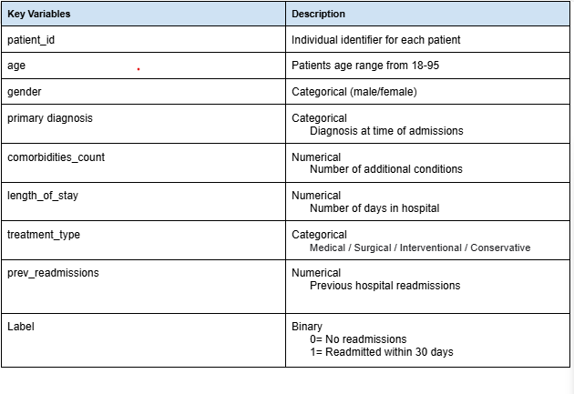

# Enhancing Hospital Efficiency: A SQL Analysis of Hospital Readmission Risks

## Project Objective 

Repeat hospital visits increase healthcare costs, reduce operational efficiency, and may reflect opportunities to improve patient care. This project aims to identify the key factors associated with readmissions and provide actionable recommendations to help reduce preventable readmissions. 

- **Database Setup:** `1_create_database.sql` – Creates the project database and hospital readmissions table.
- **Exploratory Analysis:** `2_exploratory_analysis.sql` – Generates descriptive statistics and summarizes the overall readmission problem.
- **Business Analysis:** `3_business_analysis.sql` – Answers the primary business questions using SQL queries and aggregation techniques.

## Dataset Overview 
Time Period: 2021–2023
Records: 8,000 unique patient records
The original dataset consists of 15 columns, including patient demographics (age, gender, region), clinical information (primary diagnosis, comorbidities, previous readmissions), treatment details (treatment type, medications prescribed, length of stay), and discharge information. The target variable, label, indicates whether a patient was readmitted within 30 days of discharge (1 = Readmitted, 0 = Not Readmitted). 

Data Preparation
The dataset used in this project was pre-cleaned prior to analysis. Because the data was already prepared, no additional data cleaning or preprocessing was performed as part of this project. The analysis focused on exploring the data.

This analysis focuses on 9 key variables that are most relevant to evaluating factors associated with 30-day hospital readmissions. Columns that were not directly related to the project objectives were excluded to keep the analysis focused and concise. 

## Key Variables

## Research Questions

This project explores the following research questions:

### Exploratory Analysis 
1. **How serious is the hospital readmission problem?**

### Business Analysis 
1. **Which primary diagnosis are driving readmission?**
2. **Which patient characteristics are associated with readmissions?**
   - Does age influence readmission risk?
   - How do comorbidities affect the likelihood of readmission?
   - Is gender associated with readmission risk?
   - How does a patient's history of previous readmissions influence future readmissions?
3. **Which treatments are associated with lower readmission rates?**
4. **What does a high-risk patient portfolio look like? ?**
5. **Among high-risk patients, which primary diagnoses and treatment types are associated with the greatest likelihood of readmission?**
   

## Key Findings

- **Readmission burden:** Of the 8,000 patients analyzed, **77.29%** experienced a 30-day hospital readmission, indicating a significant operational and clinical challenge.

- **Age-related risk:** Readmission rates increased with age, with patients aged **65 years and older** representing the highest-risk demographic.

- **Clinical complexity:** Patients with **five or more comorbidities** had readmission rates exceeding **90%**, making them the strongest candidates for targeted interventions.

- **Gender:** Readmission rates were nearly identical between men and women, suggesting that gender was **not** a meaningful predictor of 30-day hospital readmission in this dataset.

- **Previous readmissions:** A history of prior readmissions was one of the strongest predictors of future readmission, with risk increasing substantially after the first readmission.

- **Treatment differences:** Treatment type showed only modest differences in readmission rates. However, patients receiving **conservative treatment** experienced the highest rate of readmission.

- **Diagnosis-specific risk:** While **Diabetes** and **Hypertension** accounted for the greatest number of readmissions due to patient volume, **Sepsis, COPD, Heart Failure, and Stroke** exhibited the highest readmission rates.

- **High-risk patient portfolio:** Patients aged **65 years or older**, with **five or more comorbidities** and **two or more previous readmissions**, had a **96.61%** readmission rate, identifying a population that would benefit most from intensive discharge planning and follow-up care.

- **High-risk diagnoses:** Within the high-risk patient population, **Kidney Disease, Sepsis, and Pneumonia** exhibited the highest readmission rates.

- **High-risk treatment patterns:** Among high-risk patients, those receiving **conservative treatment** experienced the highest readmission rate, while **medical treatment** accounted for the largest number of high-risk patients.

  
## Recommendations

Prioritize post-discharge care for patients aged 65 years and older.

Implement enhanced care management for patients with five or more comorbidities.

Increase follow-up monitoring for patients with a history of previous readmissions.

Develop targeted transition-of-care programs for patients with high-risk diagnoses such as sepsis, kidney disease, heart failure, and pneumonia.

Evaluate the effectiveness of conservative treatment strategies to identify opportunities for reducing readmissions.
